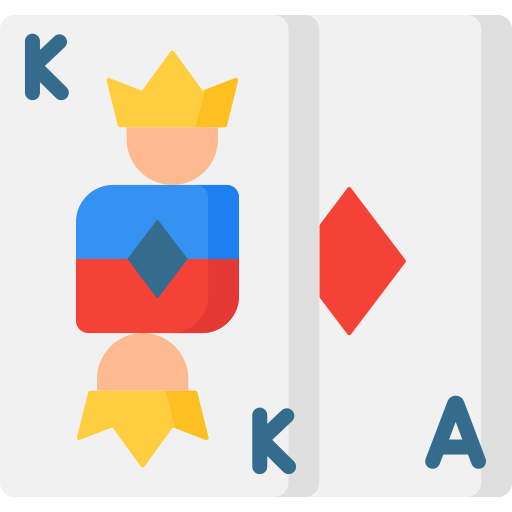
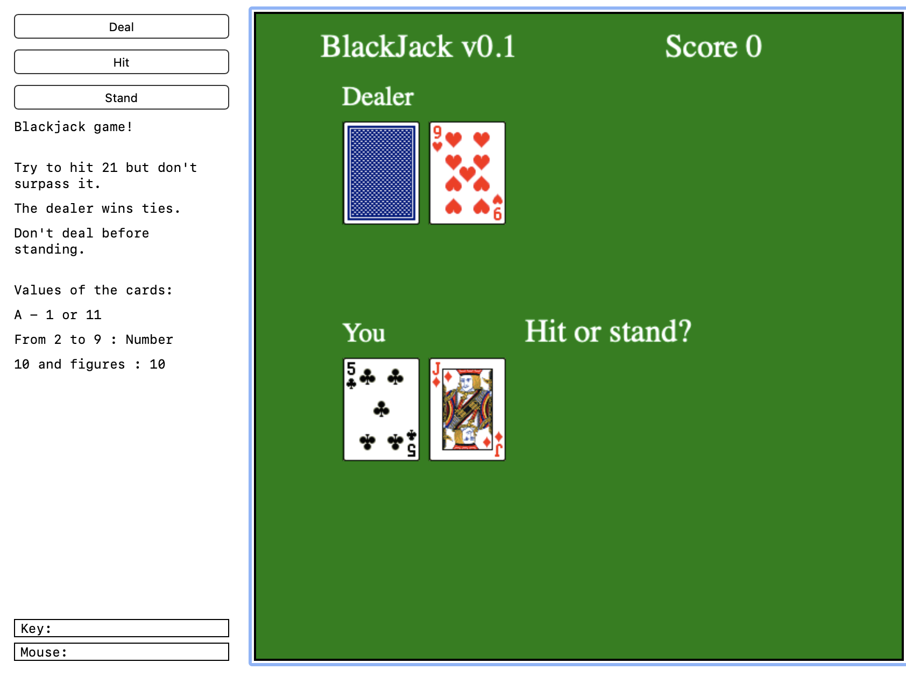
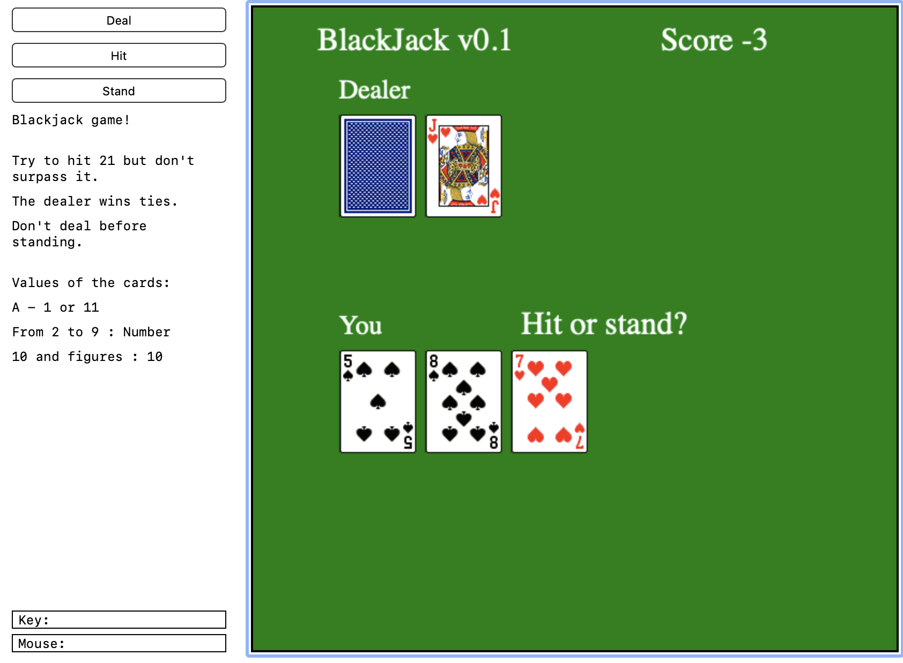
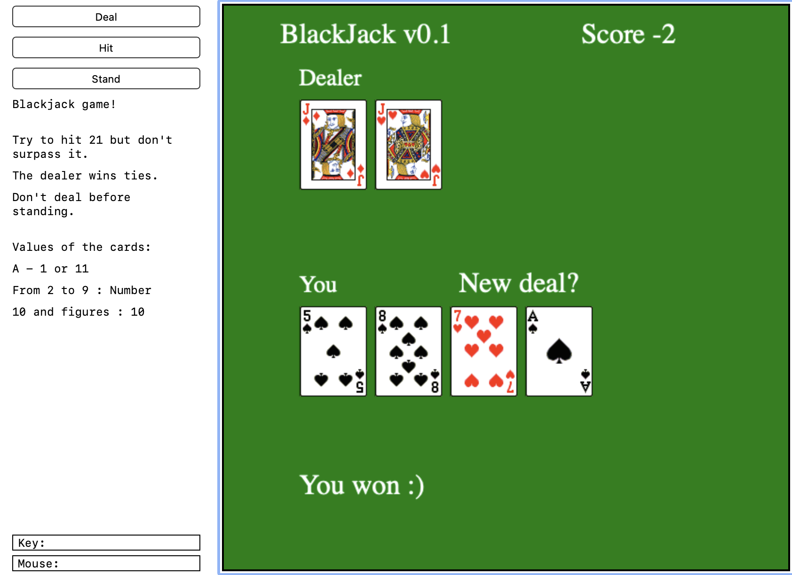
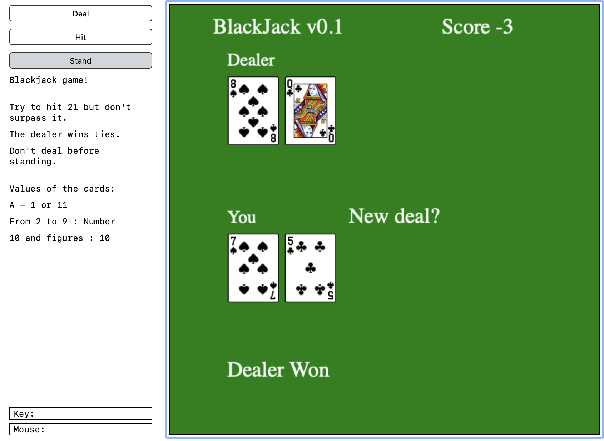
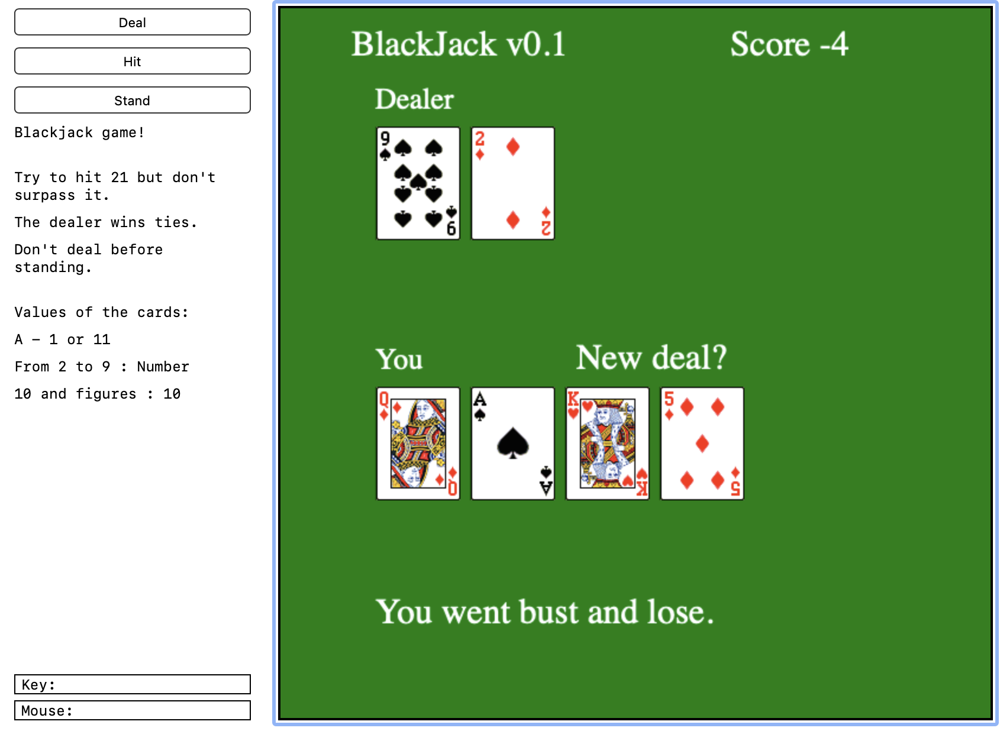

#  &nbsp; BlackJack -

The classic game Blackjack was built using Python as a part of the minor specialization in [Fundamentals of Computing using Python offered by Rice University, Texas](https://www.coursera.org/specializations/computer-fundamentals). An online IDE, named [CodeSkulptor](https://py2.codeskulptor.org/) was used for building this project. It is a single player game where the standard rules of the game apply. You can find the implementation of the code [here](http://www.codeskulptor.org/#user47_fH8KLWZeWugfabk.py).

## Game Images -

 &nbsp;
 &nbsp;
 &nbsp;
 &nbsp;

Icons made by <a href="https://www.freepik.com" title="Freepik">Freepik</a> from <a href="https://www.flaticon.com/" title="Flaticon">www.flaticon.com</a>

[
